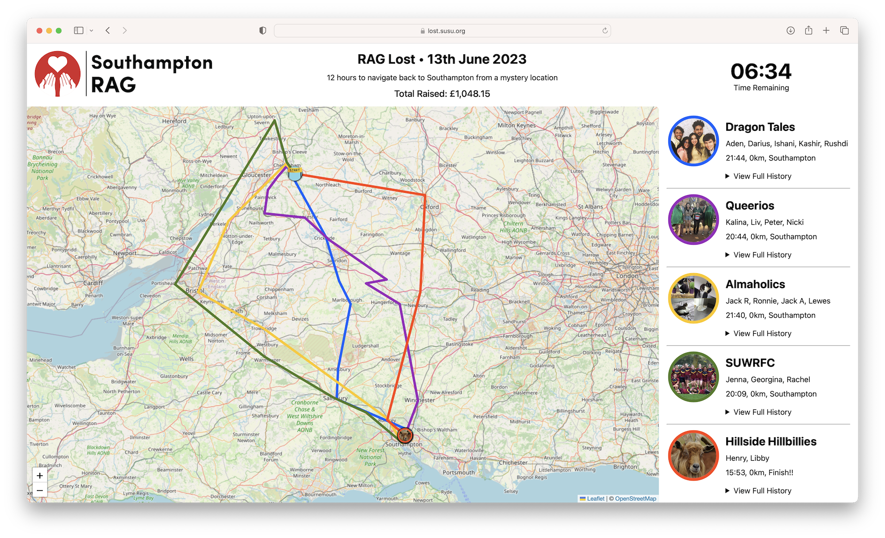

# RAG Lost

The online tracker for Southampton RAG Lost!



## Contents

* [Getting Started](#getting-started)
* [Usage](#usage)
* [Gotchas and Limitations](#gotchas-and-limitations)
* [Deploying to Production](#deploying-to-production)

## Getting Started

1. Clone the repo
```
git clone https://github.com/bilaalrashid/rag-lost.git
```
2. Initialise a mock MySQL/MariaDB database by running all of the files [`migrations/migration-*.sql`](https://github.com/bilaalrashid/rag-lost/tree/main/migrations) in numerical order
3. Edit [`public/php/stores/__connect.php`](https://github.com/bilaalrashid/rag-lost/blob/main/public/php/stores/__connect.php) with the connection details of your mock database
4. Setup a mock Apache/Nginx server with the server directory set to the [`public/`](https://github.com/bilaalrashid/rag-lost/tree/main/public) directory

## Usage

Once the system is hosted, pretty much everything can be configured from the Admin panel which is hosted at [`/admin`](https://lost.susu.org/admin), which should be the first page you visit. Any changes you make here will be automatically refreshed in the main tracker page, which is accessible at [`/`](https://lost.susu.org). Before the event is set to start (i.e. the time that the participants are released), a holding page is displayed instead of the map to prevent spoilers of the drop-off location.

When resetting for a future year, just delete all of the previous teams and all corresponding data on disk and in the database will be deleted alongside it. I would **strongly** advise against deleting data directly from the database unless you know exactly what you're doing. Specifically, don't delete rows from the `config` table.

Data for the tracker page is refreshed using the API, which delivers JSON from GET requests:
- [`/api/config.php`](https://lost.susu.org/api/config.php)
- [`/api/teams.php`](https://lost.susu.org/api/teams.php)

A full export CSVs and images used in dashboard can be downloading as a zip by sending a GET request to:
- [`/api/export.php`](https://lost.susu.org/api/export.php)

These can also be used to power other apps or bots that may wish to use this data.

## Gotchas and Limitations

This project was written specifically for the [SUSU Clubs & Societies Webhosting](http://hosting.susu.org). This gives us SFTP-only access to a single webroot directory from which our code gets served through Apache, supporting both PHP 5 and Python 2 (correct as of June 2023). Crucially we do not have any shell access or access to any directories outside the webroot. This has given us some severe limitations when designing this project. Whilst this codebase manages to use a custom MVC pattern that is readable, extensible and securely protects against most of the most common web vulnerabilities, it should not be considered to be an exemplar project to copy if you have greater control of your hosting environment. Ideally you would want to use modern PHP language features such as [type declarations](https://www.php.net/manual/en/language.types.declarations.php), a package manager like [Composer](https://getcomposer.org) and a proper MVC framework like [Laravel](https://laravel.com), [Symphony](https://symfony.com) or [CakePHP](https://cakephp.org). (Or, even better, you would want to build your application in a different language). You would probably also want to host it using containers, such as [Docker](https://www.docker.com) or [Podman](https://podman.io).

Whilst there is logic that determines if the user should be displayed the tracker page or the holding page depending on the current time (in order to prevent spoilers of the drop-off location). This same logic does not apply to the API, so this information could be leaked in advance by accessing the API endpoints.

Finally, this system only supports the Lost event (where people try to make their way back from a mystery location to Southampton). It does not support the Jailbreak event (where people try to get as far away from Southampton as possible), although that may be possible to achieve with some tweaks to this codebase. The recovered code for the old Jailbreak site is stored in the [`ragtacker`](https://github.com/bilaalrashid/rag-lost/tree/ragtracker) branch.

## Deploying to Production

1. Setup a production database and initialise the schema by running all of the files [`migrations/migration-*.sql`](https://github.com/bilaalrashid/rag-lost/tree/main/migrations) in numerical order
2. Backup the existing webroot directory on the production server
3. Upload the contents of the [`public/`](https://github.com/bilaalrashid/rag-lost/tree/main/public) directory to the webroot directory of the production server
4. Edit [`public/php/stores/__connect.php`](https://github.com/bilaalrashid/rag-lost/blob/main/public/php/stores/__connect.php) with the connection details of your mock database
5. Edit [`public/php/helpers/AuthenticationController.php`](https://github.com/bilaalrashid/rag-lost/blob/main/public/php/helpers/AuthenticationController.php) with credentials for the admin panel
6. Security: Configure your server (e.g. Apache .htaccess or Nginx config) to return HTTP 403 Forbidden when accessing anything in the [`public/php/`](https://github.com/bilaalrashid/rag-lost/tree/main/public/php) directory.
7. Security: Setup an SSL certificate and redirect all HTTP traffic to HTTPS
8. Security: Secure the rest of your hosting environment
